# 📝 pd-markdown-editor

[](https://github.com/pidan/pd-markdown-editor)
[](https://github.com/pidan/pd-markdown-editor)
[](LICENSE)

A high-performance, modular, and framework-agnostic Markdown editor monorepo. Powered by **CodeMirror 6**, designed for extensibility and premium user experience.

---

## ✨ Features

- 🚀 **Framework Agnostic Core**: Lightweight editor engine built on CodeMirror 6.
- ⚛️ **Modern Adapters**: Official support for **React** and **Vue 3**.
- 🛠️ **Plugin System**: Easily extend functionality (Image Upload, TOC, custom syntax).
- 🌓 **Themes**: Beautiful GitHub-inspired Light and Dark modes.
- 📊 **Split-View**: Real-time side-by-side preview with synchronized scrolling support.
- ⌨️ **Keyboard Shortcuts**: Rich set of standard Markdown formatting shortcuts.
- 🎨 **Rich Typography**: Styled preview via `pd-markdown-ui`.

---

## 📦 Monorepo Structure

| Package | Version | Description |
|---|---|---|
| [`pd-markdown`](./packages/markdown) | `0.1.0` | Core Markdown parser & highlighters. |
| [`pd-markdown-ui`](./packages/markdown-ui) | `0.1.0` | CSS & HTML UI for Markdown preview. |
| [`pd-editor-core`](./packages/editor-core) | `0.1.0` | Framework-agnostic editor engine. |
| [`pd-editor-react`](./packages/react) | `0.1.0` | React adapter & hooks. |
| [`pd-editor-vue`](./packages/vue) | `0.1.0` | Vue 3 adapter & composables. |

---

## 🚀 Quick Start

### React Usage

```tsx
import { MarkdownEditor } from 'pd-editor-react';
import { useState } from 'react';

function App() {
  const [value, setValue] = useState('# Hello pd-editor');

  return (
    <MarkdownEditor
      value={value}
      onChange={setValue}
      theme="light"
      preview="split"
      height="600px"
    />
  );
}
```

### Vue 3 Usage

```vue
<script setup>
import { ref } from 'vue';
import { MarkdownEditor } from 'pd-editor-vue';

const content = ref('# Hello pd-editor');
</script>

<template>
  <MarkdownEditor 
    v-model="content" 
    theme="dark" 
    preview="split" 
  />
</template>
```

### Core JS (Vanilla)

```ts
import { MarkdownEditor } from 'pd-editor-core';

const editor = new MarkdownEditor({
  parent: document.getElementById('editor'),
  initialValue: '# Vanilla JS Example',
  theme: 'light',
  onChange: (val) => console.log(val)
});
```

---

## 🧩 Plugin System

`pd-editor` comes with a powerful plugin system. You can use built-in plugins or create your own.

### Built-in Plugins

- **Image Upload**: Supports paste and drag-and-drop.
- **TOC**: Generates a live Table of Contents sidebar.

```ts
import { MarkdownEditor } from 'pd-editor-react'; // or vue/core
import { imageUploadPlugin, tocPlugin } from 'pd-editor-core';

// ... in your component
<MarkdownEditor 
  plugins={[
    imageUploadPlugin({ 
      upload: async (file) => 'https://cdn.example.com/' + file.name 
    }),
    tocPlugin()
  ]}
/>
```

---

## 🛠️ Development

This monorepo uses `pnpm` and `tsup` for high-performance builds.

```bash
# Install dependencies
pnpm install

# Build all packages
pnpm build

# Run demos
pnpm --filter react-demo dev
pnpm --filter vue-demo dev

# Linting
pnpm lint
```

## 📐 Architecture

The project follows a layered architecture to ensure maximum reusability:

```mermaid
graph TD
    A[pd-markdown] --> B[pd-markdown-ui]
    A --> C[pd-editor-core]
    B --> C
    C --> D[pd-editor-react]
    C --> E[pd-editor-vue]
```



## 📄 License

MIT © [pidan](https://github.com/pidan)
