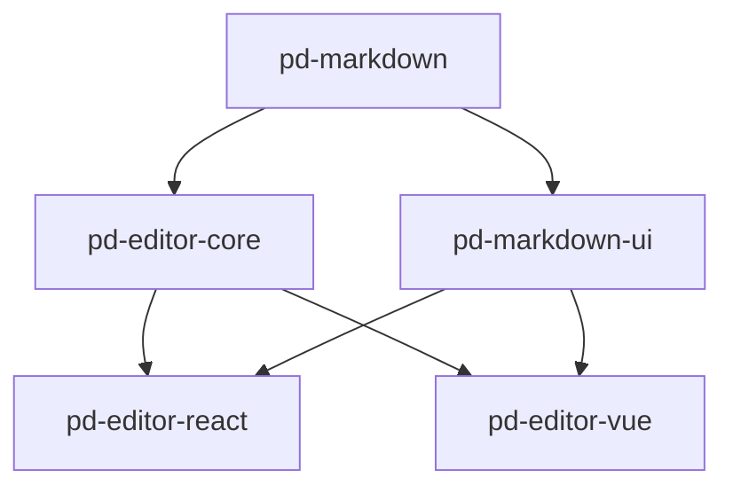

# 📝 pd-markdown-editor

[](https://github.com/pidan/pd-markdown-editor)
[](https://github.com/pidan/pd-markdown-editor)
[](LICENSE)

A high-performance, modular, and framework-agnostic Markdown editor monorepo. Powered by **CodeMirror 6**, designed for extensibility and premium user experience.

---

## ✨ Features

- 🚀 **Framework Agnostic Core**: Lightweight editor engine built on CodeMirror 6.
- ⚛️ **Modern Adapters**: Official support for **React** and **Vue 3**.
- 🛠️ **Plugin System**: Easily extend functionality (Image Upload, TOC, custom syntax).
- 🌓 **Themes**: Beautiful GitHub-inspired Light and Dark modes.
- 📊 **Split-View**: Real-time side-by-side preview with synchronized scrolling support.
- ⌨️ **Keyboard Shortcuts**: Rich set of standard Markdown formatting shortcuts.
- 🎨 **Rich Typography**: Styled preview via `pd-markdown-ui`.

---

## 📦 Monorepo Structure

| Package | Version | Description |
|---|---|---|
| [`pd-markdown`](https://www.npmjs.com/package/pd-markdown) | `2.x` | External Markdown parser & renderer. |
| [`pd-markdown-ui`](https://www.npmjs.com/package/pd-markdown-ui) | `1.x` | External Markdown preview UI primitives. |
| [`pd-editor-core`](./packages/editor-core) | `1.x` | Framework-agnostic editor engine. |
| [`pd-editor-react`](./packages/react) | `1.x` | React adapter & hooks. |
| [`pd-editor-vue`](./packages/vue) | `1.x` | Vue 3 adapter & composables. |

---

## 🚀 Quick Start

Install the adapter with its framework peers. The styled React/Vue entries also expect Tailwind because `pd-markdown-ui` uses `pd-shad-ui`'s Tailwind-powered `pd-*` classes.

```bash
pnpm add pd-editor-react pd-editor-core react react-dom tailwindcss
# or
pnpm add pd-editor-vue pd-editor-core vue tailwindcss
```

### React Usage

```tsx
import { MarkdownEditor } from 'pd-editor-react';
import { useState } from 'react';

function App() {
  const [value, setValue] = useState('# Hello pd-editor');

  return (
    <MarkdownEditor
      value={value}
      onChange={setValue}
      theme="light"
      preview="split"
      height="600px"
    />
  );
}
```

The default React and Vue entries include `pd-shad-ui` and KaTeX styles automatically. For manual style control, import the headless entry and styles explicitly:

```tsx
import { MarkdownEditor } from 'pd-editor-react/headless';
import 'pd-editor-react/styles.css';
```

### Vue 3 Usage

```vue
<script setup>
import { ref } from 'vue';
import { MarkdownEditor } from 'pd-editor-vue';

const content = ref('# Hello pd-editor');
</script>

<template>
  <MarkdownEditor 
    v-model="content" 
    theme="dark" 
    preview="split" 
  />
</template>
```

### Core JS (Vanilla)

```ts
import { MarkdownEditor } from 'pd-editor-core';

const editor = new MarkdownEditor({
  parent: document.getElementById('editor'),
  initialValue: '# Vanilla JS Example',
  theme: 'light',
  onChange: (val) => console.log(val)
});
```

---

## 🧩 Plugin System

`pd-editor` comes with a powerful plugin system. You can use built-in plugins or create your own.

### Built-in Plugins

- **Image Upload**: Supports paste and drag-and-drop.
- **TOC**: Generates a live Table of Contents sidebar.

```ts
import { MarkdownEditor } from 'pd-editor-react'; // or vue/core
import { imageUploadPlugin, tocPlugin } from 'pd-editor-core';

// ... in your component
<MarkdownEditor 
  plugins={[
    imageUploadPlugin({ 
      upload: async (file) => 'https://cdn.example.com/' + file.name 
    }),
    tocPlugin()
  ]}
/>
```

Runtime plugins can also be installed and removed after the editor is mounted:

```ts
editor.use(tocPlugin());
editor.unuse('toc');
```

## ⌨️ Editing Experience

The core editor includes Markdown-aware typing behavior:

- `Enter` continues bullet, ordered, task, and quote blocks.
- Empty list/task/quote markers are removed on `Enter`.
- `Tab` and `Shift+Tab` indent and outdent Markdown block lines.
- Formatting shortcuts cover bold, italic, links, headings, lists, quotes, and strikethrough.

Toolbar integrations can query command state directly:

```ts
editor.isActive('bold');
editor.canExecute('link');
editor.getCommandState('heading2'); // { active, enabled }
```

---

## 🛠️ Development

This monorepo uses `pnpm`, `tsup`, Vitest, and Changesets for build, test, and release workflows.

```bash
# Install dependencies
pnpm install

# Full CI gate
pnpm run ci

# Build all packages
pnpm build

# Run demos
pnpm --filter react-demo dev
pnpm --filter vue-demo dev

# Linting
pnpm lint
```

Packages are versioned and published through Changesets:

```bash
pnpm changeset
pnpm version-packages
pnpm release
```

## 📐 Architecture

The project follows a layered architecture to ensure maximum reusability:



## 📄 License

MIT © [pidan](https://github.com/pidan)
