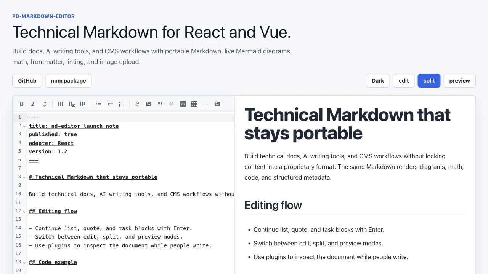
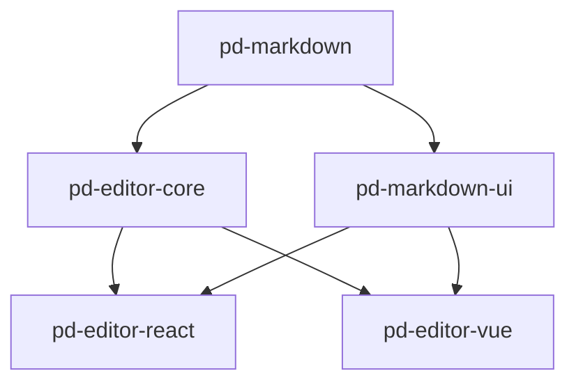

# 📝 pd-markdown-editor

[](https://github.com/LaoChen1994/pd-markdown-editor/actions/workflows/ci.yml)
[](https://laochen1994.github.io/pd-markdown-editor/)
[](https://www.npmjs.com/package/pd-editor-react)
[](https://www.npmjs.com/package/pd-editor-vue)
[](https://github.com/LaoChen1994/pd-markdown-editor)
[](LICENSE)

An embeddable Markdown editor SDK for **technical content, AI writing tools, and CMS workflows**. Build with React, Vue 3, or the framework-agnostic CodeMirror 6 core while keeping content portable Markdown.

[Try the live demo](https://laochen1994.github.io/pd-markdown-editor/) · [React on npm](https://www.npmjs.com/package/pd-editor-react) · [Vue on npm](https://www.npmjs.com/package/pd-editor-vue) · [Star on GitHub](https://github.com/LaoChen1994/pd-markdown-editor)



---

## Why This Editor?

Use `pd-markdown-editor` when your product needs more than a textarea plus preview:

- **Technical Markdown by default**: Mermaid, math, frontmatter, tables, task lists, code blocks, lint diagnostics, TOC, and image upload are already wired into one editor stack.
- **One core, multiple adapters**: React, Vue 3, and vanilla JavaScript share the same CodeMirror 6 core and plugin contracts.
- **Portable content**: Users edit plain Markdown, so AI output, CMS content, docs, and changelogs remain easy to store, diff, review, and migrate.
- **Product-friendly escape hatches**: Bring your own CodeMirror extensions, preview component map, upload handler, toolbar, and runtime plugins.

## When To Pick It

| Need | Why it fits |
|---|---|
| AI writing or copilot output editor | Markdown stays streamable, diffable, and easy to post-process. |
| CMS or admin Markdown field | Built-in upload, preview modes, frontmatter, and lint hooks cover common publishing workflows. |
| Developer docs or knowledge base | Mermaid, math, code blocks, TOC, and heading ids are included. |
| React + Vue product suite | One core API keeps behavior aligned across framework adapters. |

## Compared With Common Choices

| Editor choice | Best for | `pd-markdown-editor` difference |
|---|---|---|
| Plain `<textarea>` | Small forms and comments | Adds CodeMirror editing, commands, shortcuts, preview, plugins, and upload hooks. |
| General React Markdown editors | Simple React-only editing | Adds Vue/Core adapters and technical-content plugins in the same repo. |
| Headless Markdown parsers | Custom render pipelines | Adds an embeddable editor shell while keeping parser/render customization open. |

---

## ✨ Features

- 🧰 **Technical Content Included**: Preview Mermaid diagrams, math, code blocks, and frontmatter without assembling the rendering stack yourself.
- 🤖 **AI-ready Markdown**: Keep generated and edited content in a portable text format that is easy to store, diff, stream, and transform.
- ⚛️ **React, Vue, or Vanilla**: Use a ready-made framework component or build a custom shell on the shared CodeMirror 6 core.
- 🛠️ **Workflow Plugins**: Built-in plugins for uploads, TOC, code blocks, Mermaid, math, frontmatter, and lint diagnostics.
- 📦 **Bundle-conscious Defaults**: Optional fenced code language data for smaller default editor bundles.
- 🌓 **Themes**: Beautiful GitHub-inspired Light and Dark modes.
- 📊 **Split-View**: Real-time side-by-side editing and preview.
- ⌨️ **Editing Controls**: Standard Markdown shortcuts plus toolbar access to undo, redo, and search/replace.
- 🎨 **Rich Typography**: Styled preview via `pd-markdown-ui`.

---

## 📦 Monorepo Structure

| Package | Version | Description |
|---|---|---|
| [`pd-editor-core`](./packages/editor-core) | `2.x` | Framework-agnostic editor engine. |
| [`pd-editor-react`](./packages/react) | `2.x` | React adapter & hooks. |
| [`pd-editor-vue`](./packages/vue) | `2.x` | Vue 3 adapter & composables. |
| [`examples/react-demo`](./examples/react-demo) | private | React demo app. |
| [`examples/vue-demo`](./examples/vue-demo) | private | Vue 3 demo app. |

External runtime dependencies include [`pd-markdown`](https://www.npmjs.com/package/pd-markdown) for parsing/rendering and [`pd-markdown-ui`](https://www.npmjs.com/package/pd-markdown-ui) for preview UI primitives; they are not packages in this monorepo.

---

## 🚀 Quick Start

Install one adapter in an existing React or Vue application. It installs the core editor and includes the default preview styles.

```bash
pnpm add pd-editor-react
# or
pnpm add pd-editor-vue
```

### React Usage

```tsx
import { MarkdownEditor } from 'pd-editor-react';
import { useState } from 'react';

function App() {
  const [value, setValue] = useState('# Hello pd-editor');

  return (
    <MarkdownEditor
      value={value}
      onChange={setValue}
      theme="light"
      preview="split"
      height="600px"
    />
  );
}
```

The default React and Vue entries include preview and KaTeX styles automatically. For manual style control, import the headless entry and styles explicitly:

```tsx
import { MarkdownEditor } from 'pd-editor-react/headless';
import 'pd-editor-react/styles.css';
```

### Vue 3 Usage

```vue
<script setup>
import { ref } from 'vue';
import { MarkdownEditor } from 'pd-editor-vue';

const content = ref('# Hello pd-editor');
</script>

<template>
  <MarkdownEditor 
    v-model="content" 
    theme="dark" 
    preview="split" 
  />
</template>
```

### Core JS (Vanilla)

```ts
import { MarkdownEditor } from 'pd-editor-core';

const editor = new MarkdownEditor({
  parent: document.getElementById('editor'),
  initialValue: '# Vanilla JS Example',
  theme: 'light',
  onChange: (val) => console.log(val)
});
```

---

## 🧩 Plugin System

`pd-editor` comes with a powerful plugin system. You can use built-in plugins or create your own.

### Built-in Plugins

- **Image Upload**: Supports paste and drag-and-drop.
- **TOC**: Generates a live Table of Contents sidebar.
- **Code Highlight**: Extracts fenced code blocks and language class metadata.
- **Mermaid**: Extracts Mermaid fenced code blocks and creates safe diagram container elements.
- **Math**: Extracts inline `$...$` and block `$$...$$` expressions.
- **Frontmatter**: Parses top-level YAML frontmatter into metadata and body content.
- **Markdown Lint**: Reports diagnostics for missing image alt text, empty links, heading jumps, and duplicate headings.

```ts
import { MarkdownEditor } from 'pd-editor-react'; // or vue/core
import {
  codeHighlightPlugin,
  frontmatterPlugin,
  imageUploadPlugin,
  markdownLintPlugin,
  mathPlugin,
  mermaidPlugin,
  tocPlugin,
} from 'pd-editor-core';

// ... in your component
<MarkdownEditor 
  plugins={[
    tocPlugin(),
    codeHighlightPlugin({
      onCodeBlocks: (blocks) => console.log(blocks),
    }),
    mermaidPlugin({
      onDiagrams: (diagrams) => console.log(diagrams),
    }),
    mathPlugin({
      onExpressions: (expressions) => console.log(expressions),
    }),
    frontmatterPlugin({
      onFrontmatter: (frontmatter) => console.log(frontmatter.data),
    }),
    markdownLintPlugin({
      onDiagnostics: (diagnostics) => console.log(diagnostics),
    }),
    imageUploadPlugin({ 
      handler: async (file) => 'https://cdn.example.com/' + file.name
    }),
  ]}
/>
```

The content plugins above are core analysis plugins: they parse editor content and report structured results through callbacks. They do not bundle heavy renderers such as Mermaid or KaTeX; applications can use the callback data to render diagrams, math, warnings, or metadata in React, Vue, or any other UI layer.

Runtime plugins can also be installed and removed after the editor is mounted:

```ts
editor.use(tocPlugin());
editor.unuse('toc');
```

The React and Vue preview adapters do not render raw HTML Markdown nodes by default. If your application needs embedded HTML, sanitize it before rendering it through a custom preview pipeline.

Default fenced code previews stay lightweight and render semantic `<pre><code>` markup without loading a full syntax-highlighting language catalog. Use `renderComponentMap` when your application needs a specific highlighter.

## ⌨️ Editing Experience

The core editor includes Markdown-aware typing behavior:

- `Enter` continues bullet, ordered, task, and quote blocks.
- Empty list/task/quote markers are removed on `Enter`.
- `Tab` and `Shift+Tab` indent and outdent Markdown block lines.
- Formatting shortcuts cover bold, italic, links, headings, lists, quotes, and strikethrough.

Toolbar integrations can query command state directly:

```ts
editor.isActive('bold');
editor.canExecute('link');
editor.getCommandState('heading2'); // { active, enabled }
```

---

## Roadmap

The next high-impact items are intentionally product-facing:

- Built-in lint panel for the Vue demo.
- Upload progress and failure UI for image uploads.
- Copy/export actions for Markdown and rendered HTML.
- More recipes for Next.js, Vite, Nuxt, and CMS integrations.

If this matches your use case, a GitHub star helps prioritize the next release.

---

## 🛠️ Development

This monorepo uses `pnpm`, `tsup`, Vitest, and Changesets for build, test, and release workflows.

```bash
# Install dependencies
pnpm install

# Full CI gate
pnpm run ci

# Unit tests
pnpm test

# Type checking
pnpm typecheck

# Build all packages
pnpm build

# Run demos
pnpm --filter react-demo dev
pnpm --filter vue-demo dev

# Build the GitHub Pages demo
pnpm --filter pd-editor-core build
pnpm --filter pd-editor-react build
pnpm --filter react-demo build

# Linting
pnpm lint
```

Packages are versioned and published through Changesets:

```bash
pnpm changeset
pnpm version-packages
pnpm release
```

Contributions are welcome. See [CONTRIBUTING.md](./CONTRIBUTING.md) for the local workflow and pull request checklist.

## 📐 Architecture

The project follows a layered architecture to ensure maximum reusability:


```mermaid
graph TD
    A[pd-markdown] --> B[pd-markdown-ui]
    A --> C[pd-editor-core]
    C --> D[pd-editor-react]
    C --> E[pd-editor-vue]
    B --> D
    B --> E
```

## 📄 License

MIT © [pidan](https://github.com/pidan)
